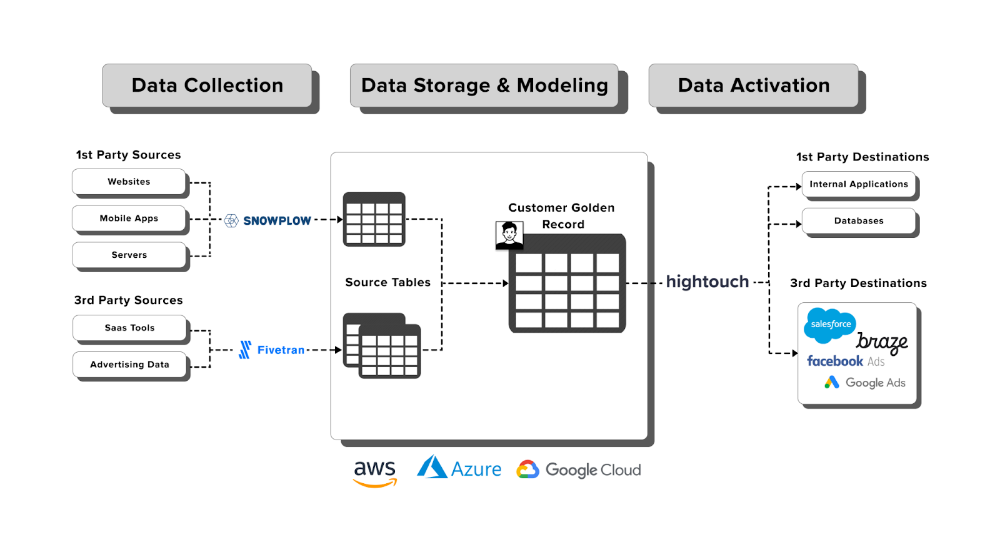

+++ title = "Composable CDP with Predictive ML Modeling"
menuTitle="Introduction"
chapter = false
weight = 1
pre = "<i class='fas fa-rocket'></i> "

aliases = [
    "/en",
    "/en/introduction"
]
+++

#### Introduction

Welcome to the **Composable CDP with Predictive ML Modeling** accelerator.
This accelerator guides you through building an advanced Composable Customer Data Platform using a selection of excellent tools for each step of the process.
* [**Snowplow**](https://snowplow.io/) for creating user behavioral data from your product.
* [**Databricks DeltaLake**](https://www.databricks.com/product/delta-lake-on-databricks) or [**Snowflake**](https://www.snowflake.com/en/) to store the data.
* [**Databricks** and **MLFlow**](https://www.databricks.com/product/managed-mlflow) or [**Snowpark**](https://www.snowflake.com/en/data-cloud/snowpark/) for training and executing sophisticated ML predictions to determine a likelihood of conversion.
* [**Hightouch**](https://hightouch.com/) activation platform to synchronize the audience segment with marketing tools (like Braze, Salesforce and Facebook Ads) and accelerate their conversion into qualified leads.

Once finished, you will be able to use predictive models to achieve a competitive advantage from customer behavior data on your website, driving higher return on ad spend.

{}
Data loaders like [Fivetran](https://www.fivetran.com/) can play an important role in a composable CDP.
In this accelerator we don't go into detail on setting these up, see [Fivetran's Documentation](https://fivetran.com/docs/destinations/databricks) if you want to learn more.
{}

***

#### Who is this guide for?

- Data scientists who would like to learn how Snowplow behavioral data can be used to build predictive ML models
- Data practitioners who want to learn how to activate Snowplow behavioral data in third party tools

***

#### What you will learn

In approximately 1 working day (~6 working hours) you can achieve the following:
- **Build a predictive model -** Build a machine learning model that can accurately predict conversion events using features collected from Snowplow's out-of-the-box modelled data
- **Data activation -** With Hightouch connected to your rich user data, you can enable your marketing teams to effortlessly build new audiences and sync to their needed destinations
- **Next steps -** Productionalize your ML model and visualize ad campaign performance synced from your Hightouch audiences


gantt
        dateFormat  HH-mm
        axisFormat %M
        section 1. Predict
        2h          :step1, 00-00, 2m
        section 2. Activate
        1h          :step2, after step1, 1m
        section 3. Next Steps
        3h          :step3, after step2, 3m



***

#### Prerequisites

{}
Complete our [Advanced Analytics for Web](https://docs.snowplow.io/accelerators/web/) accelerator if you don't have any Snowplow modelled web data in your warehouse yet. You don't need a working Snowplow pipeline, a sample events dataset is provided. You can also choose to skip this altogether and upload the 3 derived tables ([snowplow_web_page_views](https://snowplow-demo-datasets.s3.eu-central-1.amazonaws.com/cCDP/snowplow_web_page_views.csv), [snowplow_web_sessions](https://snowplow-demo-datasets.s3.eu-central-1.amazonaws.com/cCDP/snowplow_web_sessions.csv), [snowplow_web_users](https://snowplow-demo-datasets.s3.eu-central-1.amazonaws.com/cCDP/snowplow_web_users.csv)) directly through these downloadable csvs. For instructions on how to do this, check out the official [Databricks documentation](https://docs.databricks.com/ingestion/add-data/index.html) or [Snowflake documentation](https://docs.snowflake.com/en/user-guide/data-load-web-ui).
{}

**Predictive ML Modelling**
- Snowplow modelled web data (*page views*, *sessions* and *users*) stored in your data warehouse
- Conversion events, these can be derived from a Snowplow tracked event or using other sources like Salesforce data.
- Databricks or Snowflake account and a user with access to create schemas and tables

**Data Activation**
- Snowplow modelled web data (*page views*, *sessions* and *users*) stored in your data warehouse
- Set `user_id` in the tracker to your business user identifier (see [docs](https://docs.snowplow.io/docs/collecting-data/collecting-from-own-applications/javascript-trackers/javascript-tracker/javascript-tracker-v2/tracker-setup/other-parameters-2/#setting-the-user-id)) so that the user can be identified and connected to your Hightouch destinations
- Hightouch account and a user with admin role

#### What you will build

A propensity to convert ML model that empowers you to intelligently market campaigns to website visitors that are most likely to convert.

